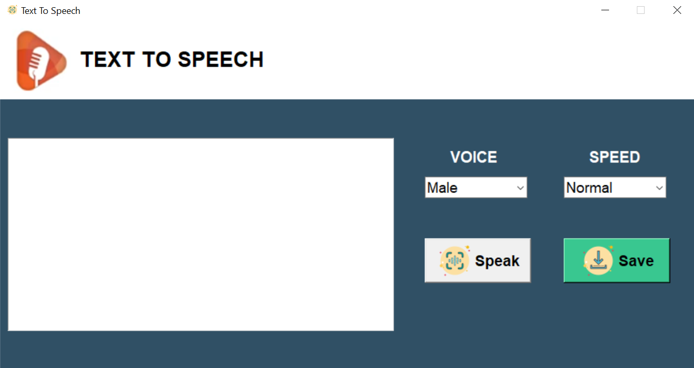

# Text to Speech Application

This is a simple **Text to Speech** (TTS) application built using **Python** and **Tkinter** for the GUI, along with **pyttsx3** for text-to-speech conversion. The application allows users to input text, select a voice (Male/Female), adjust the speech speed (Slow/Normal/Fast), and either play the text or save it as an audio file.

## Features

- **Text-to-Speech Conversion**: Converts the entered text into speech.
- **Voice Selection**: Choose between male and female voices.
- **Speech Speed Control**: Adjust the speed of the speech (Slow, Normal, Fast).
- **Save as MP3**: Save the converted speech as an MP3 file.

## Demo

 *(Add a screenshot of your application here)*

## Installation

To run this application, you need to install the following dependencies:

### Requirements

- **Python 3.x**
- **tkinter** (comes with Python)
- **pyttsx3** for text-to-speech functionality.
- **Pillow** for handling image icons in Tkinter.

### Steps

1.Install the required packages:

    pip install pyttsx3 Pillow
    
2.Run the application:

    python TextToSpeech.py
